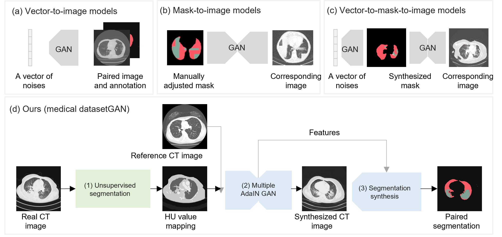

# CS2
This is the official implementation of our proposed CS2 accepted by MICCAI 2022:

CS2: A Controllable and Simultaneous Synthesizer of Images and Annotations with Minimal Human Intervention

## Highlight
The novelty of our work is three-fold: 
- we develop a novel unsupervised mask-to-image synthesis pipeline that generates images controllably without human labeling; 
- instead of directly using the numeric and disarranged unsupervised segmentation masks, which are cluttered with over-segmented super-pixels, we assign the mean Hounsfield unit(HU) value for each cluster in the unsupervised segmentation masks to obtain anordered and well-organized labeling; 
- we propose a new synthesis network structure featured by multiple adaptive instance normalization (AdaIN) blocks that handles unaligned structural and tissue information.

## Requirements

matplotlib==3.3.4

opencv-python==4.5.3.56

Pillow==8.3.2

pytorch-fid==0.2.0

scikit-image==0.17.2

scipy==1.5.4

torch==1.9.0

torchvision==0.10.0

## Citation
This repository partially based on:

- pix2pixHD: High-Resolution Image Synthesis and Semantic Manipulation with Conditional GANs ([code](https://github.com/NVIDIA/pix2pixHD) and 
[paper](https://arxiv.org/abs/1711.11585));

- An implementation of Unsupervised Image Segmentation by Backpropagation: Faster and more elegant than origin version（[code](https://github.com/Yonv1943/Unsupervised-Segmentation) and [paper](https://arxiv.org/abs/1711.11585](https://kanezaki.github.io/pytorch-unsupervised-segmentation/ICASSP2018_kanezaki.pdf)))

